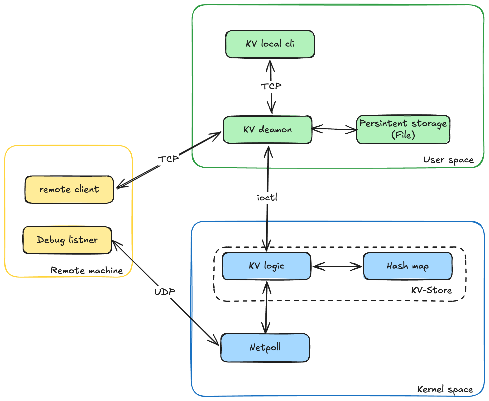

# Linux Kernel Module Key-Value Store (OS-LKM)

A high-performance, concurrent **Key-Value Store implemented as a Linux Kernel Module (LKM)**. It features an in-kernel hash table, character device interface (`/dev/kv_store`), user-space daemon with PAM authentication, interactive CLI client interface, and performance benchmarking tool.

## Architecture Overview



## Core Features

- **In-Kernel Hash Table Engine**:
  - Fine-grained per-bucket spinlocks for thread-safe concurrent access.
  - Memory management powered by Linux kernel `kmalloc`/`kfree`.
  - Full CRUD support: insert, lookup, update, delete, snapshot, and entry counting.

- **Kernel Character Device Interface**:
  - Exposes `/dev/kv_store` with custom ioctls defined in [`include/kv_ioctl.h`](include/kv_ioctl.h).
  - Automatically configured with standard permissions (`0666`).

- **Netpoll UDP Integration**:
  - Transmits kernel network notification messages via `netpoll_send_udp` to remote debug listeners.

- **User-Space Daemon Server**:
  - Multi-threaded TCP socket server running on port `9999`.
  - Integrated **Linux PAM (Pluggable Authentication Modules)** authentication.
  - Snapshot persistence: Automatically restores state from `/var/lib/kvstore/snapshot.bin` on startup and flushes store contents on graceful shutdown (`SIGINT`/`SIGTERM`).

- **Interactive CLI Client**:
  - Menu-driven terminal interface with password echo suppression and socket communication.

- **Benchmarking Suite**:
  - C++ performance harness measuring single-thread baselines, concurrent read/write throughput, and multi-thread latency.

## Prerequisites & Installation

### Build Requirements
Ensure kernel headers and build utilities are installed:

```bash
# Ubuntu / Debian
sudo apt-get update
sudo apt-get install build-essential linux-headers-$(uname -r) libpam0g-dev
```

## Building the Components

You can build each component using its respective `Makefile`:

### 1. Build the Kernel Module
```bash
cd kernel
make
```
Produces `kvstore.ko`.

### 2. Build the Daemon Server
```bash
cd user/daemon
make setup   # Creates /var/lib/kvstore with appropriate permissions
make         # Compiles daemon executable
```

### 3. Build the CLI Client
```bash
cd user/client
make
```
Produces `client.o`.

### 4. Build the Benchmark Tool
```bash
cd benchmark
make
```
Produces `benchmark` executable.

## Usage Guide

### Step 1: Load the Kernel Module
Load the compiled module into the kernel:
```bash
sudo insmod kernel/kvstore.ko
```
Verify device node creation and kernel log output:
```bash
ls -l /dev/kv_store
dmesg | tail -n 20
```

### Step 2: Run the Daemon Server
Start the daemon server (requires root/sudo access for device access and snapshot file setup):
```bash
sudo user/daemon/daemon
```

### Step 3: Run the Interactive CLI Client
In another terminal, connect to the daemon:
```bash
# Connect to localhost
./user/client/client.o

# Or connect to remote daemon IP
./user/client/client.o 192.168.1.100
```
Log in using system credentials. Menu choices:
1. **Insert**: Add a key-value pair.
2. **Update**: Update an existing key.
3. **Get**: Retrieve value for a key.
4. **Delete**: Remove key from store.
5. **Snapshot**: List active key-value entries.
6. **Exit**: Terminate client session.

### Step 4: Run Benchmarks
Launch the benchmarking harness:
```bash
./benchmark/benchmark
```
Select from 4 available benchmarks:
- `1`: Baseline (Single Thread)
- `2`: Concurrent Read/Write
- `3`: Latency Benchmark (Single Core)
- `4`: Latency Benchmark (Multi Thread)

### Unloading the Kernel Module
To shutdown the system cleanly:
```bash
# Stop daemon (Ctrl+C in daemon terminal)
sudo rmmod kvstore
```

## IOCTL Reference

Defined in [`include/kv_ioctl.h`](include/kv_ioctl.h):

| Command | Type | Description |
| :--- | :--- | :--- |
| `KV_INSERT` | `_IOW` | Insert key-value pair into kernel hash table |
| `KV_DELETE` | `_IOW` | Delete key-value pair by key |
| `KV_GET` | `_IOWR` | Retrieve value for a given key |
| `KV_UPDATE` | `_IOW` | Update value for an existing key |
| `KV_SNAPSHOT` | `_IOWR` | Export table snapshot into user-space buffer |
| `KV_COUNT` | `_IOR` | Retrieve total count of active key-value pairs |

### Data Structures

```c
struct kv_message {
    int status;
    unsigned long long key;
    char value[64];
};

struct kv_snapshot_message {
    int status;
    unsigned int capacity;
    unsigned int count;
    struct kv_message entries[];
};
```

## Authors

Developed by **@jonatanwestling** and **@algotgraner**.
